# Vehicle Detection

The goals / steps of this project are the following:

* Perform a Histogram of Oriented Gradients (HOG) feature extraction on a labeled training set of images and train a classifier Linear SVM classifier
* Optionally, you can also apply a color transform and append binned color features, as well as histograms of color, to your HOG feature vector. 
* Note: for those first two steps don't forget to normalize your features and randomize a selection for training and testing.
* Implement a sliding-window technique and use your trained classifier to search for vehicles in images.
* Run your pipeline on a video stream (start with the test_video.mp4 and later implement on full project_video.mp4) and create a heat map of recurring detections frame by frame to reject outliers and follow detected vehicles.
* Estimate a bounding box for vehicles detected.

### Histogram of Oriented Gradients (HOG)

#### 1. Explain how (and identify where in your code) you extracted HOG features from the training images.

I started by reading in all the `vehicle` and `non-vehicle` images.  Here is an example of one of each of the `vehicle` and `non-vehicle` classes:

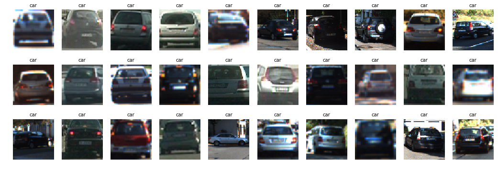
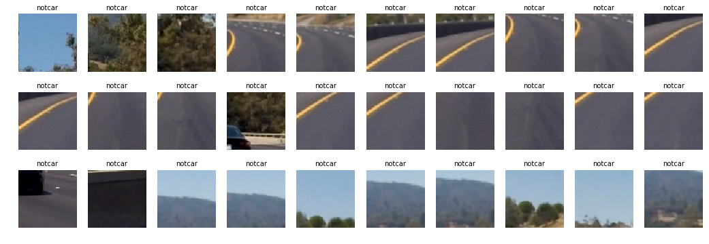

The code for extracting HOG features is defined by the function get_hog_features of the utils.py. The figure below shows histogram of oriented gradients of a car and non-cars.

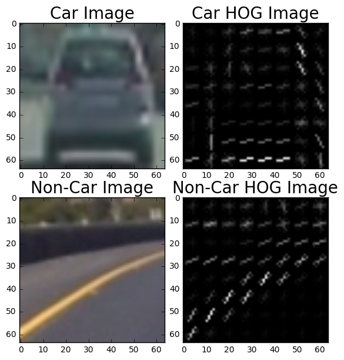

#### 2. Explain how you settled on your final choice of HOG parameters.

I then explored different color spaces and different `skimage.hog()` parameters (`orientations`, `pixels_per_cell`, and `cells_per_block`).  I just tried the below three combinations of parameters.

| conf | colorspace | orientations | pixels per cell | cells per block | HOG |
| :--: | :--------: | :----------: | :-------------: | :-------------: | :-: |
| 1 | RGB | 9 | 8 | 2 | ALL |
| 2 | YCrCb | 9 | 8 | 2 | ALL | 
| 3 | YCrCb | 12 | 16 | 2 | ALL |

As a result, I found conf2 of conf works better than the other conf, the accuracy of SVM classifier is up to 98.59%. So I think that conf2 is good enough for this case.

#### 3. Describe how (and identify where in your code) you trained a classifier using your selected HOG features (and color features if you used them).

I trained a linear SVM with the default classifier parameters and using features    which combined HOG, bin spatial and color hist. It was able to achieve a test accuracy of 98.59%.

### Sliding Window Search

#### 1. Describe how (and identify where in your code) you implemented a sliding window search.  How did you decide what scales to search and how much to overlap windows?

In this project, it's good idea to establish a minimum and a maximu scale at which you expect the object to appper and then reasonable number of intermediate scales to scan as well.

The image below shows the first attempt at using find_cars on one of the test images, using a single window size:

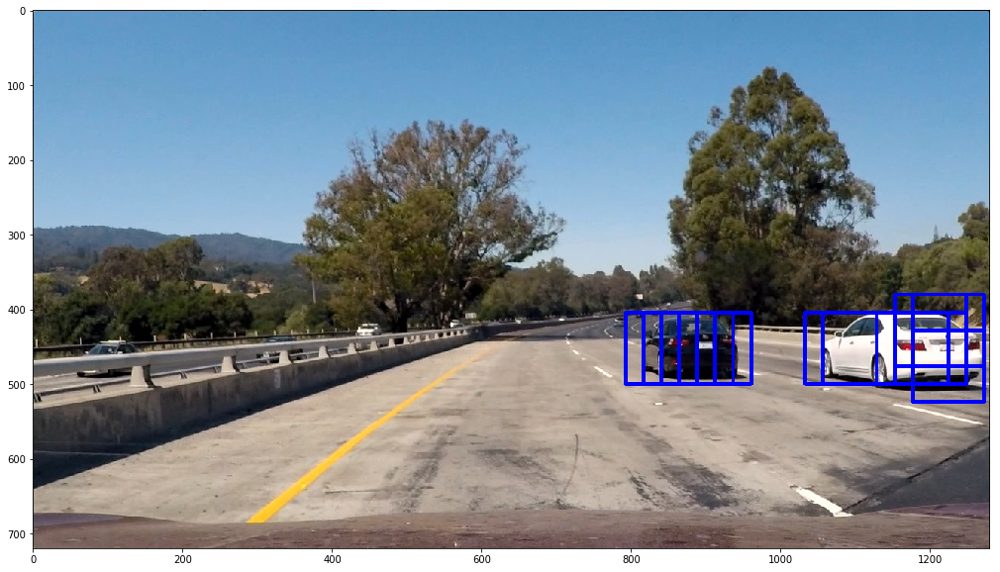

I explored several configurations of window sizes and positions, with various overlaps in the X and Y directions. The following four images show the configurations of all search windows in the final implementation, for small (1x), medium (1.5x, 2x), and large (3x) windows:
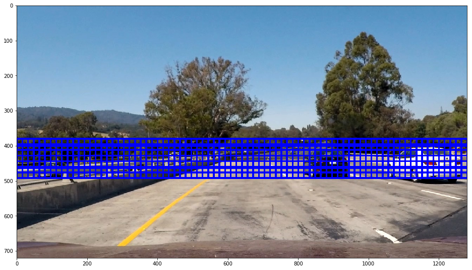
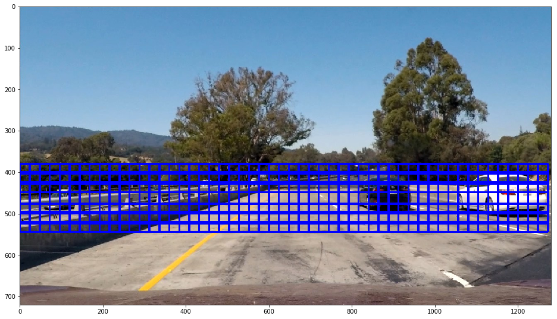
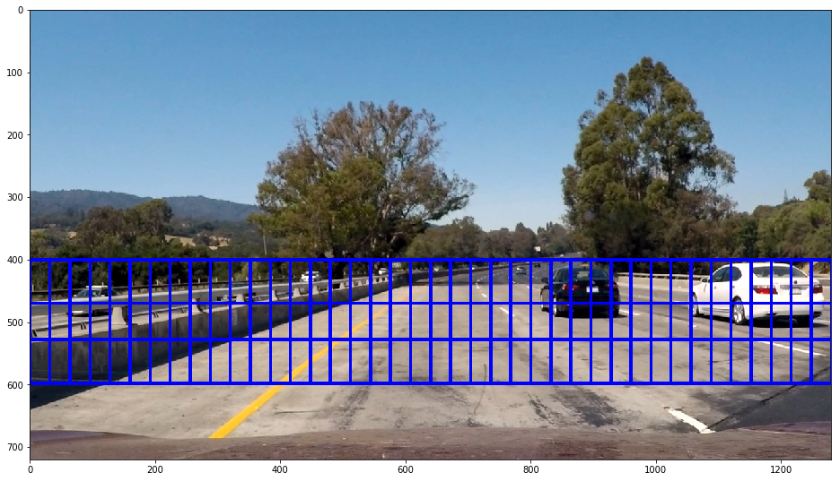
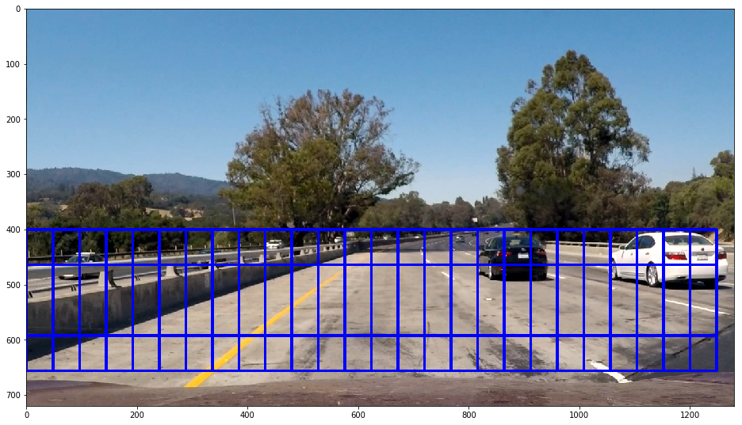

The find_cars only has to extract hog features once and then can be sub-sampled to get all of its overlaying windows. Each window is defined by a scaling factor where a scale of 1 would result in a window that's 8 x 8 cells then the overlap of each window is in terms of the cell distance. This means that a cells_per_step = 2 would result in a search window overlap of 75%. Its possible to run this same function multiple times for different scale values to generate multiple-scaled search windows.

The image below shows the rectangles returned by find_cars drawn onto one of the test images in the final implementation. Notice that there are several positive predictions on each of the near-field cars, and one positive prediction on a car in the oncoming lane.
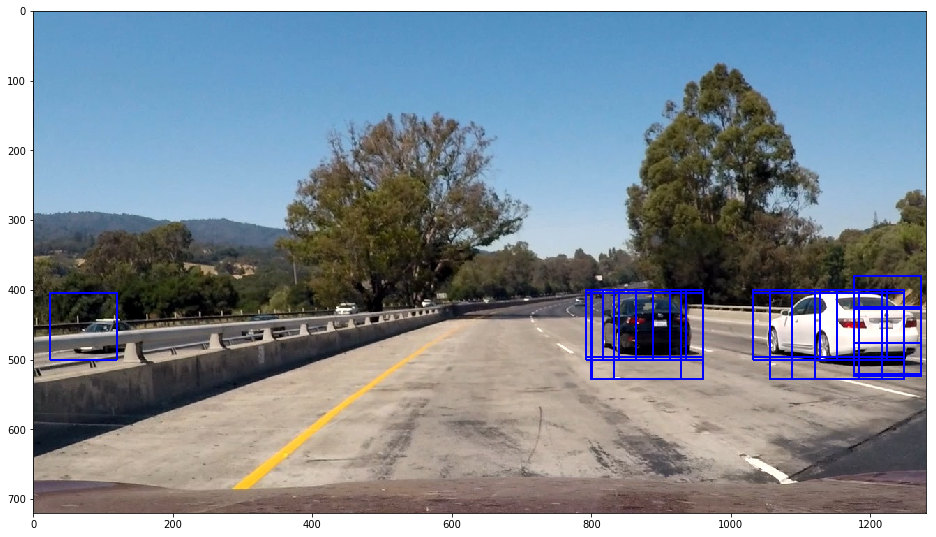

I will build a heat-map in order to combine overlapping detections, remove false positives and the positive predictions of the oncoming lane.

To make a heat-map, you're simply going to add "heat" (+=1) for all pixels within windows where a positive detection is reported by your classifier. The following image is the resulting heatmap from the detections in the image above:

A threshold is applied to the heatmap (in this example, with a value of 1), setting all pixels that don't exceed the threshold to zero. The result is below:
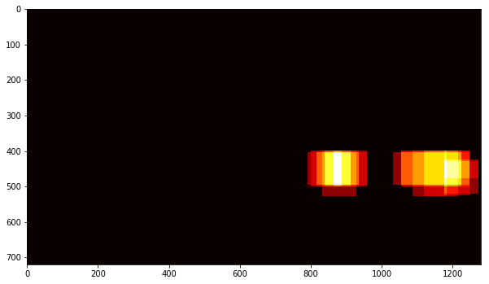

The scipy.ndimage.measurements.label() function collects spatially contiguous areas of the heatmap and assigns each a label:
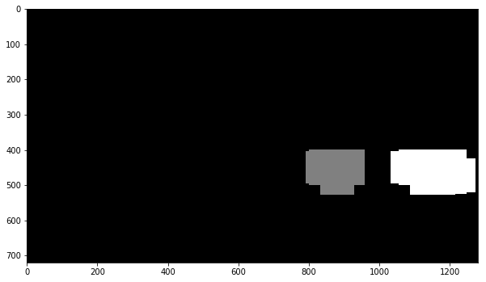

And the final detection area is set to the extremities of each identified label:
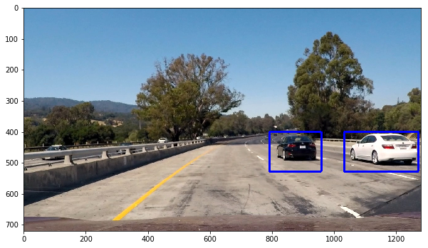

#### 2. Show some examples of test images to demonstrate how your pipeline is working.  What did you do to optimize the performance of your classifier?

Ultimately I searched on two scales using YCrCb 3-channel HOG features plus spatially binned color and histograms of color in the feature vector, which provided a nice result.  Here are some example images:

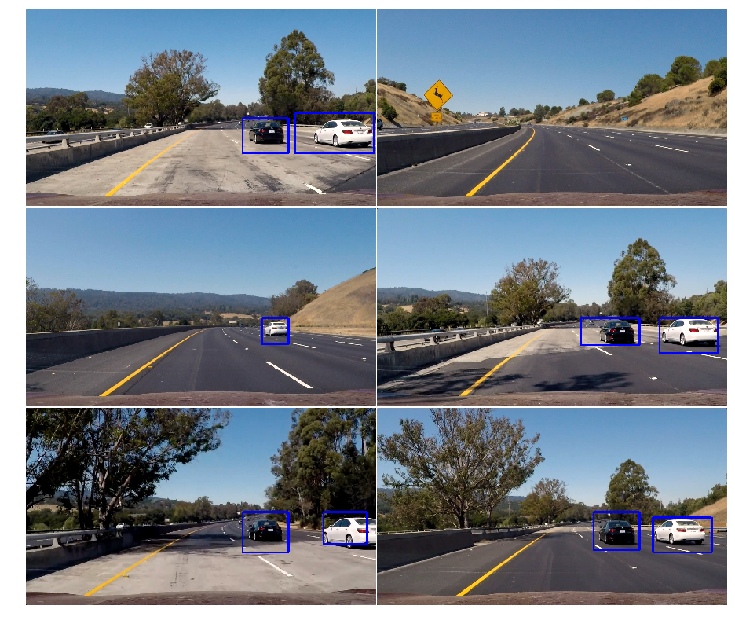

The first implementation did not perform as well, so I began by optimizing the SVM classifier. The original classifier used HOG features from the RBG 3-channel, and achieved a test accuracy of 97.33%. Using YCrCb 3-channel HOG features plus spatially binned color and histograms of color solution, it increased the accuracy to 98.59%.

Other optimization techniques included lowering the heatmap threshold to improve accuracy of the detection.

---

### Video Implementation

#### 1. Provide a link to your final video output.  Your pipeline should perform reasonably well on the entire project video (somewhat wobbly or unstable bounding boxes are ok as long as you are identifying the vehicles most of the time with minimal false positives.)
Here's a [link to my video result](./project_video_out.mp4)

#### 2. Describe how (and identify where in your code) you implemented some kind of filter for false positives and some method for combining overlapping bounding boxes.

I defined a class called Vehicle_Detect for holding the detection rectangles of previous n frames. Insteaded performing the heatmap/threshold/label steps for the current frame's detections, the detections for the past n frames are combined and added to the heatmap and the threshold for the heatmap is set to 1 + len(veh.prev_rects)//2 (one more than half the number of rectangle sets contained in the history) - this value was found to perform best empirically.

---

### Discussion

#### 1. Briefly discuss any problems / issues you faced in your implementation of this project.  Where will your pipeline likely fail?  What could you do to make it more robust?

The first problem that I faced is detection accuracy. I have tried some solution, finally I found the solution of YCrCb 3-channel HOG plus spatially binned color and histograms of color is good enough for this project, but I think it's not the best.
The second problem that I faced is the detection retangle jitter in the pipeline. So I used cache previous n frames to smooth it.

The pipeline is probably most likely to fail in cases where vehicles don't resemble those in the training dataset, but lighting and environmental conditions might also play a role (e.g. a white car against a white background). As stated above, oncoming cars are an issue, as well as distant cars .

Some suggestions for making it more robust:
- The evaluation of feature vectors to be parallelized.
- determine vehicle location and speed to predict its location in subsequent frames.

